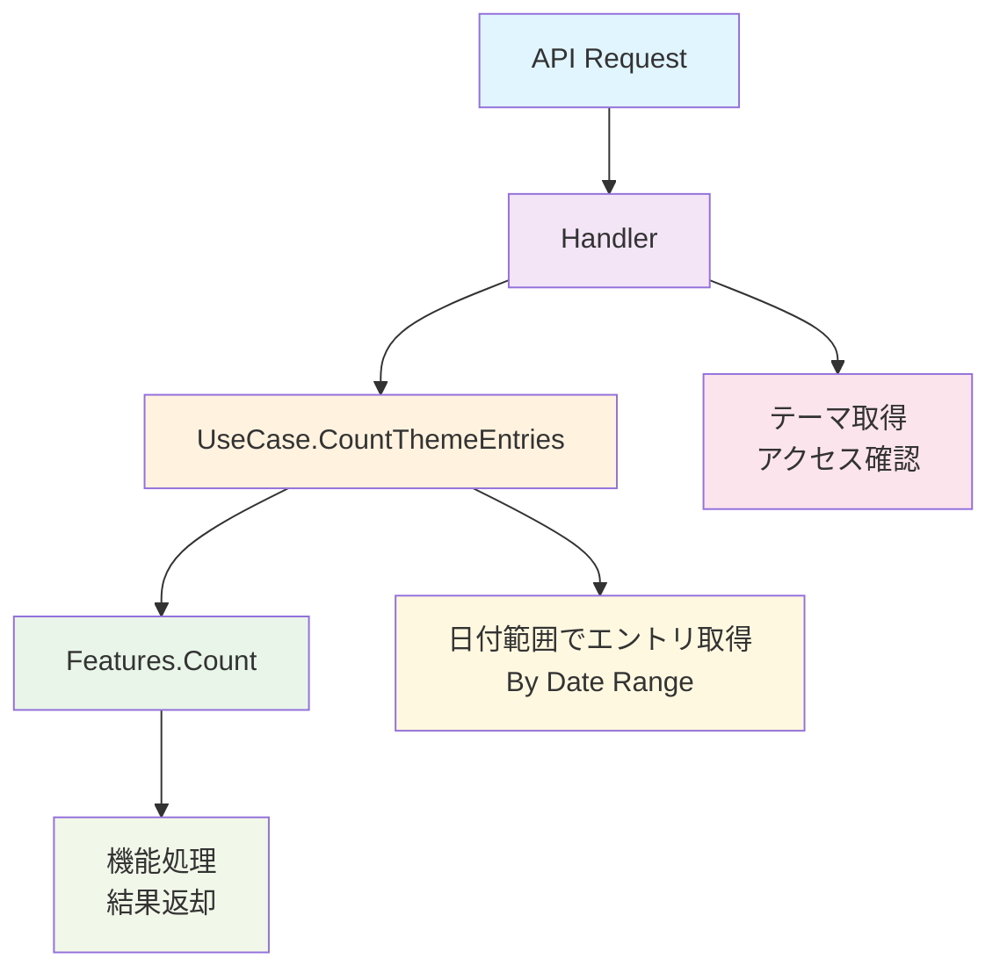

# 機能処理システム - API使用ガイド

## 概要

機能処理システムは、テーマがデータ解析と集計のための「summation」や「discount_summation」などの特定の機能をサポートできるようにします。

## アーキテクチャ



## 主要コンポーネント

### 1. 機能システム (`internal/usecase/features/count.go`)

- **NewFeatures()**: Features構造体のコンストラクタ
- **Count(entries, theme)**: 機能検出を含むメイン処理メソッド
  - `theme.SupportedFeatures`をループ処理
  - 機能固有のロジックを実行
  - サポートされていない機能の場合は0.0をデフォルトとして返却

### 2. データ取得 (`internal/usecase/get_count_entrry.go`)

- **CountThemeEntries()**: データフローを調整
  - テーマを取得し、アクセスを検証
  - 日付範囲でエントリを取得
  - `entry.Entries`型に変換
  - Features.Count()で処理

### 3. APIエンドポイント (`internal/presentation/api/handler/handler.go`)

- **GetThemesThemeIdFeaturesFeatureName()**: HTTPハンドラ
  - 日付範囲パラメータをサポート
  - 現在「count」機能を実装
  - 結果をJSON形式で返却

## サポートされている機能

### 合計機能
```json
{
  "supported_features": ["summation"]
}
```
- エントリデータ内のすべての数値を合計
- `entries.SumAll()`メソッドを使用
- 予算追跡、合計計算に有用

### 割引合計機能  
```json
{
  "supported_features": ["discount_summation"]
}
```
- 合計機能と似ているが、割引を適用可能
- プロモーション計算の将来的な拡張

## API使用例

### 1. テーマの機能実行

```bash
curl "http://localhost:8080/themes/{theme_id}/features/count?start_date=2025-01-01&end_date=2025-01-31"
```

**レスポンス:**
```json
{
  "feature_name": "count",
  "theme_id": "uuid-here",
  "result": 250.5,
  "start_date": "2025-01-01", 
  "end_date": "2025-01-31"
}
```

### 2. 機能付きテーマの作成

```bash
curl -X POST http://localhost:8080/themes \
  -H "Content-Type: application/json" \
  -d '{
    "theme_name": "予算トラッカー",
    "fields": [
      {"name": "amount", "label": "金額", "type": "number", "required": true}
    ],
    "supported_features": ["summation"]
  }'
```

### 3. シンプルなエントリ数の取得

```bash
curl "http://localhost:8080/entries/count?theme_id={theme_id}"
```

## テスト

### ユニットテスト
```bash
go test ./internal/usecase/features/
```

### 統合テスト  
```bash
go test ./internal/usecase/get_count_entrry_test.go
```

### 完全テストスイート
```bash
go test ./...
```

## エラーハンドリング

- **403 Forbidden**: テーマにアクセスできないか、機能がサポートされていない
- **404 Not Found**: テーマまたはエントリが見つからない
- **400 Bad Request**: 日付形式またはパラメータが無効
- **500 Internal Server Error**: 処理またはデータベースエラー

## 実装状況

✅ **完了済み:**
- 機能処理コアロジック
- データ取得と調整
- APIエンドポイント実装
- ユニットテストと統合テスト
- エラーハンドリングと検証

✅ **検証済み:**
- コードコンパイル成功
- すべてのテストがパス
- リポジトリ統合動作確認済み

🔄 **将来の拡張:**
- 追加の機能タイプ（平均、中央値など）
- 複雑な集計機能
- カスタム機能登録
- パフォーマンス最適化

## 開発ノート

- 機能検出は`theme.SupportedFeatures`の配列反復を使用
- サポートされていない機能のデフォルト戻り値は`0.0`
- `[]entry.Entry`と`entry.Entries`間の型変換は自動処理
- 日付範囲のデフォルト：指定されていない場合は30日前から今日まで
