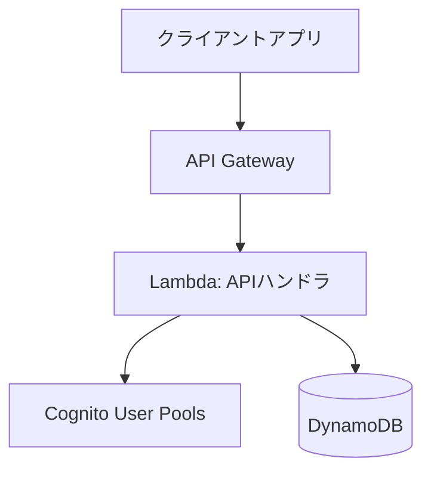

# オールインワンカレンダーアプリ バックエンド詳細設計書 (V0)

## 1. はじめに

### 1.1. 目的

本文書は、[要件定義書](./rfp.md) に基づき、オールインワンカレンダーアプリのバックエンドシステム (V0) の詳細設計を定義する。

### 1.2. 対象範囲

本設計書は、バックエンド API サービス、データベース設計、および関連する AWS インフラストラクチャの初期バージョン (V0) を対象とする。フロントエンド、および将来的な拡張機能（通知、外部連携など）は対象外とする。

### 1.3. 技術スタック

- プログラミング言語: Go
- クラウドプラットフォーム: AWS
  - コンピューティング: AWS Lambda
  - データベース: Amazon DynamoDB
  - API エンドポイント: Amazon API Gateway
  - 認証: Amazon Cognito User Pools
  - (将来利用検討) ストレージ: Amazon S3

## 2. アーキテクチャ概要

本システムは、AWS 上に構築されたサーバーレスアーキテクチャを採用する。



- **Amazon API Gateway:** クライアントからの HTTP リクエストを受け付け、単一の Lambda 関数にプロキシする。リクエスト/レスポンスの変換、認証連携 (Cognito Authorizer) を担当する。
- **AWS Lambda:** Go で実装された単一の関数 (`ApiLambda`) が、すべての API リクエストのビジネスロジックを実行する。内部で Echo フレームワークを使用し、リクエストパスに基づいて適切なハンドラ処理にルーティングする。
- **Amazon DynamoDB:** アプリケーションデータ (ユーザー情報、テーマ定義、カレンダーエントリ) を格納する NoSQL データベース。Single Table Design を採用する。
- **Amazon Cognito User Pools:** ユーザーアカウントの作成、認証、セッショントークン管理を担当する。API Gateway と連携し、認証が必要な API へのアクセス制御を行う。
- **Amazon S3:** (V0 では直接利用しないが) 将来的な設定ファイル、ユーザーアップロードファイルなどの格納場所として利用を想定。

## 3. API 設計

### 3.1. API スタイルと仕様定義

- **API スタイル:** RESTful API を採用する。クライアントが必要なデータを柔軟に取得できる GraphQL も検討したが、V0 の機能範囲と開発効率、AWS サービスとの親和性を考慮し、REST を選択する。将来的な拡張で GraphQL の導入を再検討する可能性はある。
- **API 仕様:** OpenAPI 3.0 仕様に基づき、API のエンドポイント、リクエスト/レスポンス形式、認証要件などを定義する。仕様ファイル (例: `openapi.yaml`) を API 定義の Sourse of Truth とする。
- **コード生成:** Go の `oapi-codegen` ツールなどを利用し、`openapi.yaml` からサーバーサイドの型定義 (struct) とハンドラインターフェースを自動生成する。Lambda 関数内のハンドラはこの生成されたインターフェースを実装する。これにより、仕様と実装の一貫性を保ち、開発効率と型安全性を向上させる。

### 3.2. 認証

- Amazon Cognito User Pools を利用した JWT (JSON Web Token) ベースの認証を採用する。
- 認証が必要なエンドポイントは OpenAPI 仕様内で `securitySchemes` および `security` を用いて定義する。
- API Gateway の Cognito Authorizer (または Lambda Authorizer) でリクエストヘッダーの `Authorization: Bearer <ID_Token>` を検証する。

### 3.3. エンドポイント概要

API の具体的なエンドポイント、パラメータ、リクエスト/レスポンスボディの詳細は、別途定義する `openapi.yaml` ファイルを参照すること。主なリソースと操作は以下の通り。

- **認証 (`/auth`)**: サインアップ、ログインなど
- **テーマ (`/themes`)**: デフォルトテーマ・カスタムテーマの CRUD 操作
- **エントリ (`/entries`)**: カレンダーエントリの CRUD 操作、期間指定・テーマ指定での一覧取得、検索

## 4. データモデル設計 (DynamoDB)

Single Table Design を採用し、1 つのテーブルに異なる種類のデータを格納する。

- **テーブル名:** `AxiCalendarTable` (仮)

### 4.1. キー設計

| データ種別       | PK (Partition Key) | SK (Sort Key)                   | 説明                                                                  |
| :--------------- | :----------------- | :------------------------------ | :-------------------------------------------------------------------- |
| ユーザー情報     | `USER#<user_id>`   | `PROFILE`                       | ユーザーの基本情報 (メールアドレスなど、Cognito 管理外の情報があれば) |
| テーマ定義       | `THEME#<theme_id>` | `METADATA`                      | テーマの定義情報 (`theme_name`, `fields`, `is_default`)               |
| ユーザー別テーマ | `USER#<user_id>`   | `THEME#<theme_id>`              | ユーザーが利用可能なテーマ (カスタムテーマ + デフォルトテーマの参照)  |
| エントリデータ   | `USER#<user_id>`   | `ENTRY#<entry_date>#<entry_id>` | ユーザーごとのエントリデータ (日付でソート可能)                       |
| (代替)エントリ   | `ENTRY#<entry_id>` | `METADATA`                      | エントリ ID で直接エントリを取得する場合 (必要に応じて)               |

**備考:**

- `<user_id>`: Cognito によって発行されるユーザー識別子 (Sub)。
- `<theme_id>`, `<entry_id>`: UUID v4 などで生成される一意な ID。
- `<entry_date>`: `YYYY-MM-DD` 形式。

### 4.2. Global Secondary Index (GSI)

カレンダー表示やテーマ別フィルタリングを効率化するために GSI を利用する。

- **GSI-1: エントリ日付検索用**

  - **目的:** 特定ユーザーの指定期間のエントリを効率的に取得する。
  - **GSI PK:** `USER#<user_id>`
  - **GSI SK:** `ENTRY_DATE#<entry_date>#<theme_id>` (日付とテーマで絞り込み/ソート)
  - **射影:** `entry_id`, `theme_id`, `entry_date`, `data` など必要な属性

- **GSI-2: テーマ別エントリ検索用 (オプション)**
  - **目的:** 特定テーマに属する全ユーザーのエントリを検索する (管理用など、必要であれば)。
  - **GSI PK:** `THEME#<theme_id>`
  - **GSI SK:** `ENTRY_DATE#<entry_date>#<user_id>`
  - **射影:** 必要な属性

### 4.3. アイテム構造例

#### ユーザー別テーマアイテム

```json
{
  "PK": "USER#uuid-user-abcd",
  "SK": "THEME#uuid-theme-1234", // カスタムテーマのID
  "theme_name": "読書記録", // クエリ効率化のための冗長データ
  "created_at": "2025-05-03T10:00:00Z"
}
```

#### テーマ定義アイテム

```json
{
  "PK": "THEME#uuid-theme-1234",
  "SK": "METADATA",
  "theme_name": "読書記録",
  "fields": [
    {
      "name": "book_title",
      "label": "書籍名",
      "type": "text",
      "required": true
    },
    {
      "name": "read_date",
      "label": "読了日",
      "type": "date",
      "required": false
    }
    // ...
  ],
  "is_default": false,
  "owner_user_id": "uuid-user-abcd", // 作成者 (カスタムテーマの場合)
  "created_at": "2025-05-03T10:00:00Z",
  "updated_at": "2025-05-03T10:00:00Z"
}
```

```json
// デフォルトテーマの例
{
  "PK": "THEME#default-schedule",
  "SK": "METADATA",
  "theme_name": "予定管理",
  "fields": [ ... ], // 予定管理のフィールド定義
  "is_default": true,
  "created_at": "...",
  "updated_at": "..."
}
```

#### エントリデータアイテム

```json
{
  "PK": "USER#uuid-user-abcd",
  "SK": "ENTRY#2025-05-15#uuid-entry-5678",
  "entry_id": "uuid-entry-5678", // GSI で利用するため冗長化
  "theme_id": "uuid-theme-1234", // GSI で利用するため冗長化
  "entry_date": "2025-05-15", // GSI で利用するため冗長化
  "data": {
    "book_title": "Go言語による並行処理",
    "read_date": "2025-05-15",
    "rating": 5,
    "memo": "非常に参考になった"
  },
  "created_at": "2025-05-03T11:00:00Z",
  "updated_at": "2025-05-03T11:00:00Z",
  // GSI-1 用の属性
  "GSI1PK": "USER#uuid-user-abcd",
  "GSI1SK": "ENTRY_DATE#2025-05-15#uuid-theme-1234"
}
```

## 5. 主要機能の実装方針

単一の Lambda 関数 (`ApiLambda`) 内の Go ハンドラは、`oapi-codegen` によって OpenAPI 仕様から生成されたサーバーインターフェースを実装する。Echo フレームワークがリクエストパスに基づいて適切なハンドラメソッドを呼び出す。

### 5.1. カスタムテーマ作成/編集 (例: `CreateTheme`, `UpdateTheme` ハンドラ)

- 生成されたリクエスト型に基づき、リクエストボディをデコード・バリデーションする。基本的な形式チェックは OpenAPI 仕様と生成コードで行われる。
- `fields` 配列の内容について、ビジネスロジックレベルのバリデーション (フィールド名の重複チェック、型固有の制約チェックなど) を実装する。
- バリデーション成功後、DynamoDB のデータモデルに従い、`THEME#<theme_id>/METADATA` アイテムと `USER#<user_id>/THEME#<theme_id>` アイテムを登録/更新する。
- 生成されたレスポンス型に基づき、レスポンスを構築して返す。

### 5.2. エントリ登録/編集 (例: `CreateEntry`, `UpdateEntry` ハンドラ)

- 生成されたリクエスト型に基づき、リクエストボディをデコードする。
- リクエスト内の `theme_id` を使用して、対応するテーマ定義を DynamoDB から取得する。
- 取得したテーマ定義の `fields` に基づき、リクエストボディの `data` オブジェクトのビジネスロジックレベルのバリデーション (必須項目、型チェック、テーマ定義外フィールドの排除など) を実装する。
- バリデーション成功後、DynamoDB のデータモデルに従い、`USER#<user_id>/ENTRY#<entry_date>#<entry_id>` アイテムを登録/更新する。GSI 用の属性も設定する。
- 生成されたレスポンス型に基づき、レスポンスを構築して返す。

### 5.3. カレンダー表示用データ取得 (例: `GetEntries` ハンドラ)

- 生成されたパラメータ型に基づき、クエリパラメータ (`start_date`, `end_date`, `theme_ids` など) を受け取る。
- GSI-1 (`USER#<user_id>` / `ENTRY_DATE#...`) を使用して DynamoDB クエリを実行する。
  - PK: `USER#<user_id>` (認証情報から取得)
  - SK 条件: `begins_with("ENTRY_DATE#")` かつ `between <start_date> and <end_date>`
- `theme_ids` が指定されている場合は、取得結果をフィルタリングする (DynamoDB 側でのフィルタ効率も考慮)。
- 取得したエントリデータを生成されたレスポンス型にマッピングして返す。

## 6. 非機能要件への対応

- **パフォーマンス:**
  - DynamoDB のキー設計と GSI により、主要な読み取りアクセスパターンを最適化する。
  - 単一 Lambda 関数とすることで、コールドスタートの影響を比較的受けにくくする。必要に応じて Provisioned Concurrency の利用も検討する。
  - Go の並行処理機能を活用し、外部 I/O (DynamoDB アクセスなど) を効率化する。
- **拡張性:**
  - Go のインターフェースを活用し、データストアや外部サービスへの依存を抽象化する。
  - 新しいテーマのデータ型やバリデーションルールを追加しやすいように、テーマ定義処理をモジュール化する。
  - 機能が増加し、Lambda 関数のサイズや複雑性が問題になった場合は、再度機能分割を検討する。
- **セキュリティ:**
  - Cognito による堅牢な認証・認可基盤を利用する。
  - API Gateway でリクエストバリデーションを実施する。
  - Lambda 関数の実行ロール (IAM Role) には、必要最小限の DynamoDB アクセス権限のみを付与する (Least Privilege)。
  - DynamoDB の保存データはデフォルトで暗号化される。
  - Go のコードでは、SQL インジェクションならぬ NoSQL インジェクションに注意する (パラメータ化クエリを使用)。
- **データ永続性:**
  - DynamoDB を利用することで、高い可用性と耐久性を確保する。
  - 定期的なバックアップ (Point-in-Time Recovery (PITR) の有効化) を設定する。

## 7. S3 の利用 (V0 対象外)

- 将来的に、エントリへのファイル添付機能などを実装する場合、S3 を利用する。
- アップロードされたファイルは S3 に保存し、DynamoDB のエントリアイテムには S3 オブジェクトキーを格納する。
- ファイルアクセスには署名付き URL (Signed URL) などを利用してセキュアに行う。
