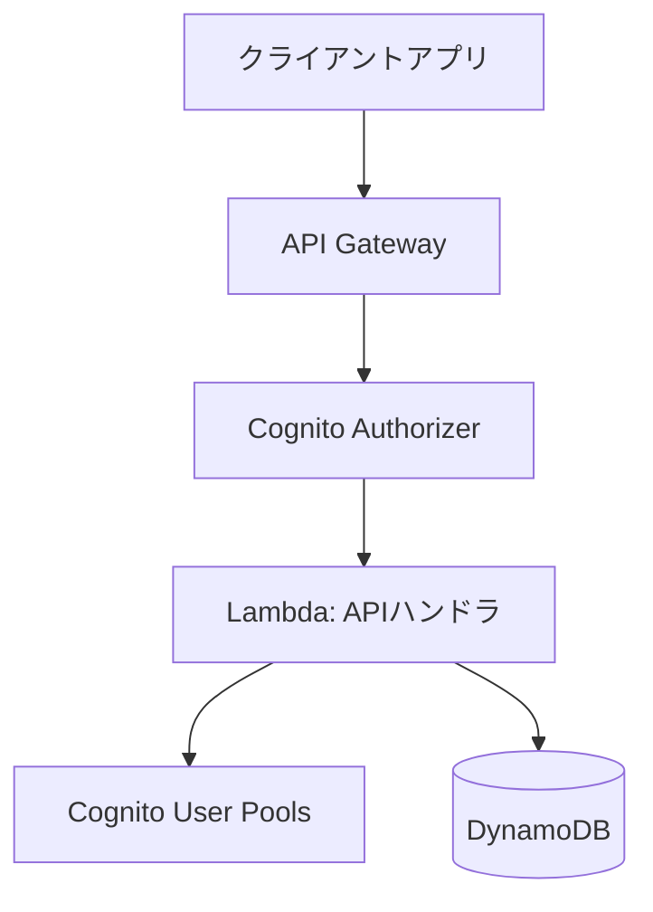
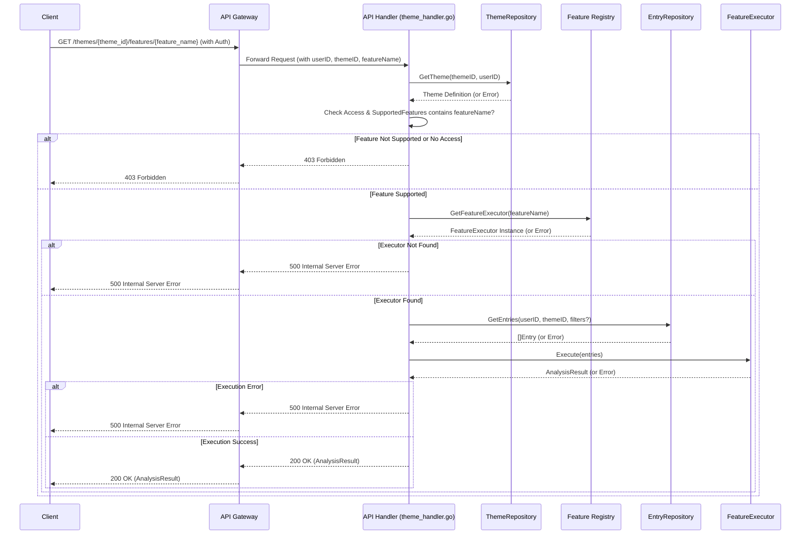

# オールインワンカレンダーアプリ バックエンド詳細設計書 (V0)

## 1. はじめに

### 1.1. 目的

本文書は、[要件定義書](./rfp.md) に基づき、オールインワンカレンダーアプリのバックエンドシステム (V0) の詳細設計を定義する。

本文書は、要件定義書、V0 設計、および V1 における議論に基づき、オールインワンカレンダーアプリのバックエンドシステム (V1.1) の詳細設計を定義する。V1.1 では、認証機能の実装に加え、テーマ固有の機能（例: 集計、分析）をメタデータで管理・実行し、再利用可能かつテーマごとに適用を制御する仕組みを導入する。

### 1.2. 対象範囲

本設計書は、バックエンド API サービス、データベース設計、および関連する AWS インフラストラクチャの V1.1 を対象とする。V0 の機能に加え、ユーザー認証、テーマ定義へのメタデータ (`supported_features`) 追加、およびメタデータに基づく汎用的な機能実行 API を含む。フロントエンド、および将来的な拡張機能（通知、外部連携など）は対象外とする。

### 1.3. 技術スタック

- **プログラミング言語:** Go
- **Web フレームワーク:** Echo
- **クラウドプラットフォーム:** AWS
- **コンピューティング:** AWS Lambda
- **データベース:** Amazon DynamoDB
- **API エンドポイント:** Amazon API Gateway
- **認証:** Amazon Cognito User Pools
- **(将来利用検討) ストレージ:** Amazon S3

## 2. アーキテクチャ概要

本システムは、AWS 上に構築されたサーバーレスアーキテクチャを採用する。



- **Amazon API Gateway:** クライアントからの HTTP リクエストを受け付け、単一の Lambda 関数にプロキシする。リクエスト/レスポンスの変換、Cognito Authorizer による認証連携を担当する。OpenAPI 仕様に基づきリクエストバリデーションも行う。
- **AWS Lambda (ApiLambda):** Go で実装された単一の関数が、すべての API リクエストのビジネスロジックを実行する。内部で Echo フレームワークを使用し、リクエストパスに基づいて適切なハンドラ処理にルーティングする。認証情報（ユーザー ID など）は Cognito Authorizer から Lambda のコンテキスト経由で受け取る。
- **Amazon DynamoDB:** アプリケーションデータ (ユーザー情報、テーマ定義、カレンダーエントリ) を格納する NoSQL データベース。Single Table Design を採用する。
- **Amazon Cognito User Pools:** ユーザーアカウントの作成、認証、セッショントークン管理を担当する。 API Gateway と連携し、認証が必要な API へのアクセス制御を行う。
- **Amazon S3:** (V1.1 では直接利用しないが) 将来的な設定ファイル、ユーザーアップロードファイルなどの格納場所として利用を想定。

## 3. 設計方針

本バックエンド開発では、以下の設計方針を組み合わせる。

- **スキーマ駆動開発 (Schema-Driven Development):**
- OpenAPI 仕様 (`openapi.yaml`) を API 定義の Source of Truth とする。
- Go の `oapi-codegen` ツールを利用し、`openapi.yaml` からサーバーサイドの型定義 (struct) とハンドラインターフェースを自動生成する。
- これにより、API 仕様と実装の乖離を防ぎ、フロントエンドとの連携を円滑にする。
- **ドメイン駆動設計 (Domain-Driven Design - DDD):**
- アプリケーションの中心となる概念（Theme, Entry, Feature など）をドメイン層として明確にモデル化する。
- ビジネスロジックをドメイン層に集約し、インフラストラクチャ（DB アクセス、API フレームワーク）への依存を低減する。
- 特に、テーマ固有機能は `FeatureExecutor` インターフェースと具体的な実装クラスに分離し、再利用性と拡張性を高める。
- **テスト駆動開発 (Test-Driven Development - TDD):**
- 機能実装前または並行してテストコードを作成する。
- ドメインロジックはユニットテストで品質を担保する。
- API ハンドラやリポジトリ層は、モックやスタブを用いたインテグレーションテストを行う。
- これにより、品質の確保、早期のバグ発見、リファクタリングの安全性を向上させる。

## 4. API 設計

### 4.1. API スタイルと仕様定義

- **API スタイル:** RESTful API を採用する。
- **API 仕様:** OpenAPI 3.0 仕様に基づき、`api/openapi.yaml` ファイルで定義する。
- **コード生成:** `oapi-codegen` を使用してサーバーインターフェースと型定義を生成する。

### 4.2. 認証

- Amazon Cognito User Pools を利用した JWT ベースの認証。
- 認証関連エンドポイントを除き、原則として全ての API で認証必須。
- OpenAPI 仕様内で `securitySchemes` および `security` を用いて認証要件を定義。
- API Gateway Cognito Authorizer が `Authorization: Bearer <ID_Token>` を検証し、Lambda コンテキストにユーザー情報 (`sub` = ユーザー ID) を渡す。

### 4.3. エンドポイント概要

詳細は `openapi.yaml` を参照。主なリソースと操作は以下の通り。

- **認証 (`/auth`):** サインアップ、ログイン、リフレッシュ、パスワードリセット、ユーザー情報取得など (Cognito と連携)。
- **テーマ (`/themes`):** デフォルトテーマ・カスタムテーマの CRUD 操作 (認証必須)。
- `GET /themes`: 利用可能なテーマ一覧取得。
- `POST /themes`: カスタムテーマ作成。
- `GET /themes/{theme_id}`: 特定テーマ定義取得。
- `PUT /themes/{theme_id}`: カスタムテーマ更新。
- `DELETE /themes/{theme_id}`: カスタムテーマ削除。
- `GET /themes/{theme_id}/features/{feature_name}`: (V1.1 追加) 特定テーマの指定された機能 (集計など) を実行。`feature_name` は機能識別子 (例: `monthly_summary`)。
- **エントリ (`/entries`):** カレンダーエントリの CRUD 操作、期間・テーマ指定での一覧取得 (認証必須)。
- `GET /entries`: エントリ一覧取得 (期間、テーマ ID などでフィルタ可能)。
- `POST /entries`: エントリ作成。
- `GET /entries/{entry_id}`: 特定エントリ取得。
- `PUT /entries/{entry_id}`: エントリ更新。
- `DELETE /entries/{entry_id}`: エントリ削除。

## 5. データモデル設計 (DynamoDB)

Single Table Design を採用。

- **テーブル名:** `AxiCalendarTable` (仮)

### 5.1. キー設計

| データ種別       | PK (Partition Key) | SK (Sort Key)                   | 説明                                                               |
| :--------------- | :----------------- | :------------------------------ | :----------------------------------------------------------------- |
| ユーザー情報     | `USER#<user_id>`   | `PROFILE`                       | ユーザー基本情報 (Cognito 管理外情報があれば)                      |
| テーマ定義       | `THEME#<theme_id>` | `METADATA`                      | テーマ定義 (name, fields, is_default, supported_features)          |
| ユーザー別テーマ | `USER#<user_id>`   | `THEME#<theme_id>`              | ユーザーが利用可能なテーマ (カスタムテーマ + デフォルトテーマ参照) |
| エントリデータ   | `USER#<user_id>`   | `ENTRY#<entry_date>#<entry_id>` | ユーザー毎のエントリ (日付でソート可能)                            |
| (代替)エントリ   | `ENTRY#<entry_id>` | `METADATA`                      | エントリ ID で直接取得する場合 (必要に応じて)                      |

- `<user_id>`: Cognito の `Sub`。
- `<theme_id>`, `<entry_id>`: UUID v4 など。
- `<entry_date>`: `YYYY-MM-DD` 形式。

### 5.2. Global Secondary Index (GSI)

- **GSI-1: エントリ日付検索用**
- **目的:** 特定ユーザーの指定期間のエントリを効率的に取得。
- **GSI PK:** `USER#<user_id>`
- **GSI SK:** `ENTRY_DATE#<entry_date>#<theme_id>` (日付とテーマで絞り込み/ソート)
- **射影:** 必要な属性 (`entry_id`, `theme_id`, `entry_date`, `data` など)
- **GSI-2: テーマ別エントリ検索用 (オプション)**
- **目的:** 特定テーマの全ユーザーエントリ検索 (管理用など)。
- **GSI PK:** `THEME#<theme_id>`
- **GSI SK:** `ENTRY_DATE#<entry_date>#<user_id>`
- **射影:** 必要な属性

### 5.3. アイテム構造例

**テーマ定義アイテム (V1.1 更新)**

```json
{
  "PK": "THEME#uuid-theme-5678", // 例: 家計簿テーマ
  "SK": "METADATA",
  "theme_name": "家計簿",
  "fields": [
    { "name": "date", "label": "日付", "type": "date", "required": true },
    { "name": "category", "label": "費目", "type": "text", "required": true },
    { "name": "amount", "label": "金額", "type": "number", "required": true },
    { "name": "memo", "label": "メモ", "type": "textarea", "required": false }
  ],
  "is_default": false,
  "owner_user_id": "uuid-user-efgh",
  // ↓ V1.1: このテーマがサポートする機能を示す識別子の配列
  "supported_features": ["monthly_summary", "category_aggregation"],
  "created_at": "2025-05-04T09:00:00Z",
  "updated_at": "2025-05-04T09:00:00Z"
}
```

**エントリデータアイテム (変更なし)**

```json
{
  "PK": "USER#uuid-user-abcd",
  "SK": "ENTRY#2025-05-15#uuid-entry-5678",
  "entry_id": "uuid-entry-5678",
  "theme_id": "uuid-theme-1234", // 読書記録テーマ
  "entry_date": "2025-05-15",
  "data": {
    "book_title": "Go言語による並行処理",
    "read_date": "2025-05-15",
    "rating": 5,
    "memo": "非常に参考になった"
  },
  "created_at": "2025-05-03T11:00:00Z",
  "updated_at": "2025-05-03T11:00:00Z",
  "GSI1PK": "USER#uuid-user-abcd",
  "GSI1SK": "ENTRY_DATE#2025-05-15#uuid-theme-1234"
}
```

## 6. 主要機能の実装方針 (Go)

単一 Lambda (ApiLambda) 内の Go コードは、以下の構造と方針で実装する。

### 6.1. 依存関係と初期化 (`cmd/api/main.go`)

- Lambda のエントリーポイント。
- 設定読み込み、DB クライアント (DynamoDB)、認証クライアント (Cognito) の初期化。
- リポジトリ層、ドメインサービス (Feature Registry を含む)、ハンドラ層のインスタンス生成と依存性注入。
- Echo フレームワークの初期化とルーティング設定 (`internal/api/router.go` で定義されたルートを使用)。

### 6.2. API ハンドラ層 (`internal/api/handler/`)

- `oapi-codegen` で生成された `ServerInterface` を実装する。
- Echo のコンテキストからリクエストパラメータ、ボディ、認証情報 (ユーザー ID) を取得。
- リクエストのバリデーション (`oapi-codegen` の機能も活用)。
- 対応するドメイン層のサービスやリポジトリを呼び出し、ビジネスロジックを実行。
- 結果を整形し、レスポンスを返す。
- エラーハンドリング (ドメイン層からのエラー、認証エラーなど)。

### 6.3. ドメイン層 (`internal/domain/`)

- **エンティティ (`theme/`, `entry/`):** `Theme`, `Entry` 構造体と、それらに関するビジネスルール (バリデーションなど) を定義。
- **リポジトリインターフェース (`theme/`, `entry/`):** データ永続化のためのインターフェース (`ThemeRepository`, `EntryRepository`) を定義。具体的な DB 実装には依存しない。
- **テーマ固有機能 (`feature/`):**
- `FeatureExecutor` インターフェース: `Execute(entries []Entry) (AnalysisResult, error)` メソッドを定義。
- 具体的な機能実装: `MonthlySummaryExecutor`, `TaskCompletionExecutor` など、`FeatureExecutor` を実装する構造体。各機能は独立して実装・テスト可能。
- 機能レジストリ (`registry.go`): 機能識別子 (文字列) と `FeatureExecutor` インスタンスのマッピング (`featureRegistry`) を保持。`GetFeatureExecutor(featureName string)` 関数を提供。
- **ドメインサービス (必要に応じて):** 複数のエンティティやリポジトリにまたがる複雑なビジネスロジックを実装。

### 6.4. リポジトリ層 (`internal/repository/dynamodb/`)

- ドメイン層で定義されたリポジトリインターフェース (`ThemeRepository`, `EntryRepository`) を DynamoDB を使って実装。
- AWS SDK for Go (v2) を使用して DynamoDB とのやり取りを行う。
- Single Table Design のキー設計に基づき、アイテムの Put, Get, Query, Update, Delete 操作を実装。
- GSI を利用したクエリも実装。

### 6.5. 認証層 (`internal/auth/`)

- Cognito User Pools とのやり取り (サインアップ、ログイン、トークン検証など) を行うクライアントを実装。AWS SDK を利用。

### 6.6. 機能実行フロー (例: `GET /themes/{theme_id}/features/{feature_name}`)

該当する API ハンドラ (`internal/api/handler/theme_handler.go` など) は以下の処理を行う。

1.  リクエストボディから `userID` を取得。
2.  パスパラメータから `themeID` と `featureName` を取得。
3.  `ThemeRepository` を使用して `themeID` に対応するテーマ定義 (`Theme` オブジェクト) を取得。同時に、`userID` に基づいてアクセス権限を確認 (デフォルトテーマ or 自身のカスタムテーマ)。
4.  取得した `Theme` オブジェクトの `SupportedFeatures` 配列に、リクエストされた `featureName` が含まれているか確認。含まれていない場合は `403 Forbidden` エラーを返す。
5.  `feature.GetFeatureExecutor(featureName)` を呼び出し、対応する `FeatureExecutor` インスタンスを取得。見つからない場合 (通常は `SupportedFeatures` チェックで防がれるが念のため) は `500 Internal Server Error` を返す。
6.  `EntryRepository` を使用して、`userID` と `themeID` に関連するエントリ (`[]Entry`) を取得 (必要に応じて日付範囲などでフィルタ)。
7.  取得した `FeatureExecutor` インスタンスの `Execute(entries)` メソッドを呼び出し、機能実行 (集計など)。
8.  実行結果 (`AnalysisResult`) を受け取り、API レスポンスとして整形して返す。
9.  各ステップで発生したエラー (DB エラー、機能実行エラーなど) を適切にハンドリングし、エラーレスポンスを返す。



## 7. 非機能要件への対応

- **パフォーマンス:**
- DynamoDB のキー設計と GSI による読み取り最適化。
- 単一 Lambda + Go による比較的低いコールドスタート影響 (必要なら Provisioned Concurrency)。
- Go の並行処理活用による I/O 効率化。
- **拡張性:**
- DDD とインターフェースによる関心事の分離。
- `FeatureExecutor` とレジストリにより、新しいテーマ固有機能の追加が容易。機能追加時に API エンドポイントの変更が不要。
- Lambda 関数の複雑性が増した場合、機能分割 (例: 認証 Lambda と API Lambda の分離) を検討。
- **セキュリティ:**
- Cognito + API Gateway Authorizer による認証・認可。
- API Gateway でのリクエストバリデーション。
- Lambda 実行ロールの最小権限付与 (Least Privilege)。
- DynamoDB のデフォルト暗号化。
- コードレベルでの入力バリデーションと NoSQL インジェクション対策。
- リソースアクセス時の所有権・権限チェック (`userID` ベース)。
- **データ永続性:**
- DynamoDB の高可用性・耐久性。
- Point-in-Time Recovery (PITR) の有効化。

## 8. ディレクトリ構成案

```
AxI_calendar/
├── cmd/
│   └── api/
│       └── main.go         # Lambda ハンドラの main パッケージとエントリーポイント
├── internal/               # アプリケーション固有のコード (外部から import されない)
│   ├── usecase/            # (旧 application) アプリケーションサービス、ユースケース
│   │   ├── create_entry_usecase.go # (例)
│   │   └── usecase.go      # (共通インターフェースやベースなど)
│   ├── domain/             # ドメインロジック (エンティティ、値オブジェクト、ドメインサービス、リポジトリインターフェース)
│   │   ├── entry/          # エントリ関連 (Entry 構造体, バリデーション, EntryRepository インターフェース)
│   │   │   └── entry.go
│   │   ├── feature/        # テーマ固有機能関連 (ドメインとしての定義)
│   │   │   ├── executor.go # FeatureExecutor インターフェース定義
│   │   │   ├── feature.go  # Feature メタデータ構造体
│   │   │   └── registry.go # 機能レジストリ (ExecutorRegistry インターフェースと実装)
│   │   ├── theme/          # テーマ関連 (Theme 構造体, バリデーション, ThemeRepository インターフェース)
│   │   │   └── theme.go
│   │   └── user/           # ユーザー関連 (User 構造体, UserRepository インターフェース)
│   │       └── user.go
│   ├── adapter/            # (旧 infrastructure) フレームワーク、ドライバ、外部サービスとの連携など具体的な実装 (リポジトリ実装、外部サービス連携クライアント)
│   │   ├── features/       # 具体的な機能の実装群 (domain/feature/executor.go を実装)
│   │   │   └── monthly_summary/
│   │   │       └── executor.go # 月次集計機能の Executor 実装
│   │   │   # (他の機能実装も同様にここに配置)
│   │   ├── persistence/    # データ永続化の実装 (ドメイン層のリポジトリインターフェースを実装)
│   │   │   └── dynamodb/   # DynamoDB 固有の実装
│   │   │       ├── entry_repository.go
│   │   │       ├── theme_repository.go
│   │   │       └── dynamodb.go   # DynamoDB クライアント初期化や共通処理
│   │   ├── auth/           # (設計概念として) 認証関連クライアント実装 (Cognito連携など)
│   │   └── config/         # (設計概念として) 設定ファイルの読み込みなど
│   ├── presentation/       # (旧 interfaces) 外部とのインターフェース (APIハンドラ、リクエスト/レスポンスの変換、プレゼンターなど)
│   │   └── api/            # API 関連
│   │       ├── handler/    # Echo ハンドラの実装 (e.g., theme_handler.go, entry_handler.go)
│   │       │   ├── handler.go
│   │       │   └── converter.go
│   │       └── api.gen.go  # oapi-codegen が生成する ServerInterface や型定義
├── openapi/                # API 仕様定義
│   └── openapi.yaml
├── deployments/            # デプロイ関連ファイル (SAM, CloudFormation, Terraform など)
├── scripts/                # ビルド、デプロイなどの補助スクリプト
├── go.mod
└── go.sum
```

## 9. S3 の利用 (V1.1 対象外)

将来的に、エントリへのファイル添付機能などを実装する場合、S3 を利用する。

- アップロードされたファイルは S3 に保存し、DynamoDB のエントリアイテムには S3 オブジェクトキーを格納する。
- ファイルアクセスには署名付き URL (Signed URL) などを利用してセキュアに行う。
