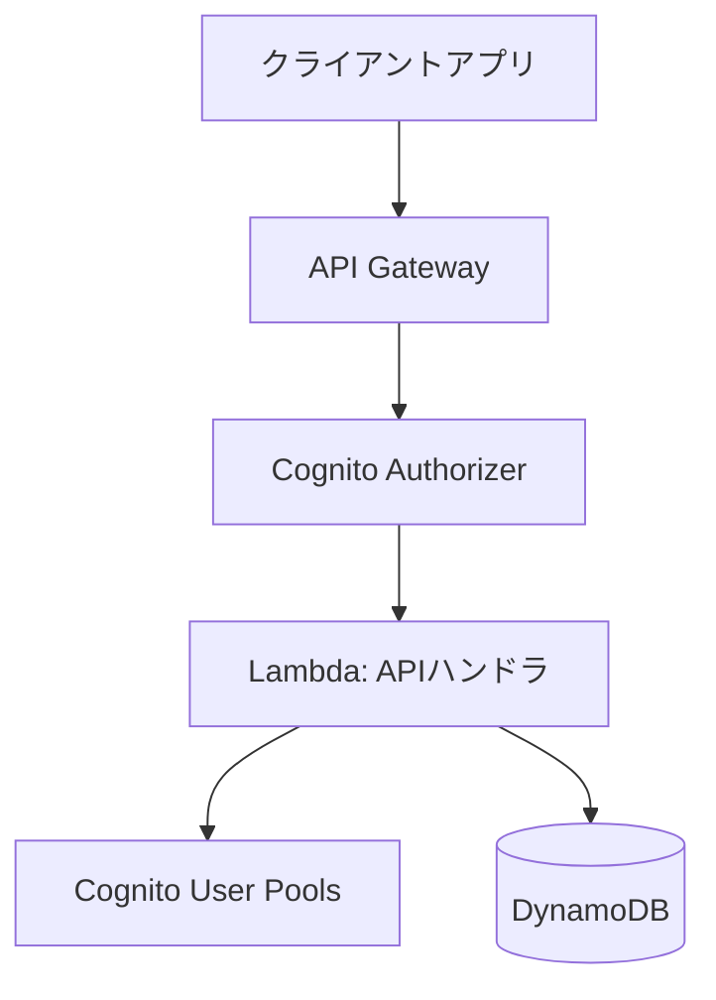

# オールインワンカレンダーアプリ バックエンド詳細設計書 (V1)

## 1. はじめに

### 1.1. 目的

本文書は、[要件定義書](./rfp.md) および V0 設計に基づき、オールインワンカレンダーアプリのバックエンドシステム (V1) の詳細設計を定義する。V1 では、**認証機能**の実装と、**テーマ固有の機能（例: 集計）をメタデータで管理・実行**する仕組みを追加する。

### 1.2. 対象範囲

本設計書は、バックエンド API サービス、データベース設計、および関連する AWS インフラストラクチャの V1 を対象とする。V0 の機能に加え、**ユーザー認証**、**テーマ定義へのメタデータ追加**、および**メタデータに基づく汎用機能 API** を含む。フロントエンド、および将来的な拡張機能（通知、外部連携など）は対象外とする。

### 1.3. 技術スタック

- プログラミング言語: Go
- クラウドプラットフォーム: AWS
  - コンピューティング: AWS Lambda
  - データベース: Amazon DynamoDB
  - API エンドポイント: Amazon API Gateway
  - 認証: Amazon Cognito User Pools
  - (将来利用検討) ストレージ: Amazon S3

## 2. アーキテクチャ概要

本システムは、AWS 上に構築されたサーバーレスアーキテクチャを採用する。(V0 と同様)



- **Amazon API Gateway:** クライアントからの HTTP リクエストを受け付け、単一の Lambda 関数にプロキシする。リクエスト/レスポンスの変換、**Cognito Authorizer による認証連携**を担当する。
- **AWS Lambda:** Go で実装された単一の関数 (`ApiLambda`) が、すべての API リクエストのビジネスロジックを実行する。内部で Echo フレームワークを使用し、リクエストパスに基づいて適切なハンドラ処理にルーティングする。**認証情報（ユーザーIDなど）は Cognito Authorizer から Lambda のコンテキスト経由で受け取る。**
- **Amazon DynamoDB:** アプリケーションデータ (ユーザー情報、テーマ定義、カレンダーエントリ) を格納する NoSQL データベース。Single Table Design を採用する。
- **Amazon Cognito User Pools:** **ユーザーアカウントの作成、認証、セッショントークン管理を担当する。** API Gateway と連携し、認証が必要な API へのアクセス制御を行う。
- **Amazon S3:** (V1 では直接利用しないが) 将来的な設定ファイル、ユーザーアップロードファイルなどの格納場所として利用を想定。

## 3. API 設計

### 3.1. API スタイルと仕様定義

- **API スタイル:** RESTful API を採用する。(V0 と同様)
- **API 仕様:** OpenAPI 3.0 仕様に基づき、API のエンドポイント、リクエスト/レスポンス形式、認証要件などを定義する。仕様ファイル (例: `openapi.yaml`) を API 定義の Sourse of Truth とする。(V0 と同様)
- **コード生成:** Go の `oapi-codegen` ツールなどを利用し、`openapi.yaml` からサーバーサイドの型定義 (struct) とハンドラインターフェースを自動生成する。(V0 と同様)

### 3.2. 認証

- Amazon Cognito User Pools を利用した JWT (JSON Web Token) ベースの認証を採用する。
- **サインアップ、ログイン等の認証関連エンドポイントを除き、原則として全ての API エンドポイントで認証を必須とする。**
- 認証が必要なエンドポイントは OpenAPI 仕様内で `securitySchemes` および `security` を用いて定義する。
- API Gateway の Cognito Authorizer でリクエストヘッダーの `Authorization: Bearer <ID_Token>` を検証し、検証成功時には Lambda 関数のコンテキストにユーザー情報 (例: `sub` = ユーザーID) を渡す。Lambda ハンドラはこのコンテキストからユーザーIDを取得して利用する。

### 3.3. エンドポイント概要

API の具体的なエンドポイント、パラメータ、リクエスト/レスポンスボディの詳細は、別途定義する `openapi.yaml` ファイルを参照すること。主なリソースと操作は以下の通り。

- **認証 (`/auth`)**:
    - `POST /auth/signup`: 新規ユーザー登録
    - `POST /auth/confirm-signup`: サインアップ確認 (確認コード入力)
    - `POST /auth/login`: ログイン (ID/Access/Refresh Token 取得)
    - `POST /auth/logout`: ログアウト (サーバーサイドでの特別な処理は通常不要だが、クライアント側のトークン削除を促す)
    - `POST /auth/refresh`: アクセストークンのリフレッシュ
    - `POST /auth/forgot-password`: パスワード忘れ申請 (確認コード送信)
    - `POST /auth/confirm-forgot-password`: 新パスワード設定 (確認コード使用)
    - `GET /auth/me`: 認証済みユーザー自身の情報を取得
- **テーマ (`/themes`)**: デフォルトテーマ・カスタムテーマの CRUD 操作 (認証必須)
    - `GET /themes`: 利用可能なテーマ一覧取得 (デフォルト + 自身のカスタム)
    - `POST /themes`: カスタムテーマ作成
    - `GET /themes/{theme_id}`: 特定テーマ定義取得
    - `PUT /themes/{theme_id}`: カスタムテーマ更新
    - `DELETE /themes/{theme_id}`: カスタムテーマ削除
    - **`GET /themes/{theme_id}/summary`: (V1追加) 特定テーマの集計機能など、メタデータに基づく汎用機能エンドポイント例**
- **エントリ (`/entries`)**: カレンダーエントリの CRUD 操作、期間指定・テーマ指定での一覧取得、検索 (認証必須)
    - `GET /entries`: エントリ一覧取得 (期間、テーマIDなどでフィルタ可能)
    - `POST /entries`: エントリ作成
    - `GET /entries/{entry_id}`: 特定エントリ取得
    - `PUT /entries/{entry_id}`: エントリ更新
    - `DELETE /entries/{entry_id}`: エントリ削除

## 4. データモデル設計 (DynamoDB)

Single Table Design を採用し、1 つのテーブルに異なる種類のデータを格納する。(V0 と同様)

- **テーブル名:** `AxiCalendarTable` (仮)

### 4.1. キー設計

| データ種別       | PK (Partition Key) | SK (Sort Key)                   | 説明                                                                  |
| :--------------- | :----------------- | :------------------------------ | :-------------------------------------------------------------------- |
| ユーザー情報     | `USER#<user_id>`   | `PROFILE`                       | ユーザーの基本情報 (メールアドレスなど、Cognito 管理外の情報があれば) |
| テーマ定義       | `THEME#<theme_id>` | `METADATA`                      | テーマの定義情報 (`theme_name`, `fields`, `is_default`, **`supported_features`**) |
| ユーザー別テーマ | `USER#<user_id>`   | `THEME#<theme_id>`              | ユーザーが利用可能なテーマ (カスタムテーマ + デフォルトテーマの参照)  |
| エントリデータ   | `USER#<user_id>`   | `ENTRY#<entry_date>#<entry_id>` | ユーザーごとのエントリデータ (日付でソート可能)                       |
| (代替)エントリ   | `ENTRY#<entry_id>` | `METADATA`                      | エントリ ID で直接エントリを取得する場合 (必要に応じて)               |

**備考:**

- `<user_id>`: Cognito によって発行されるユーザー識別子 (Sub)。
- `<theme_id>`, `<entry_id>`: UUID v4 などで生成される一意な ID。
- `<entry_date>`: `YYYY-MM-DD` 形式。

### 4.2. Global Secondary Index (GSI)

カレンダー表示やテーマ別フィルタリングを効率化するために GSI を利用する。(V0 と同様)

- **GSI-1: エントリ日付検索用**

  - **目的:** 特定ユーザーの指定期間のエントリを効率的に取得する。
  - **GSI PK:** `USER#<user_id>`
  - **GSI SK:** `ENTRY_DATE#<entry_date>#<theme_id>` (日付とテーマで絞り込み/ソート)
  - **射影:** `entry_id`, `theme_id`, `entry_date`, `data` など必要な属性

- **GSI-2: テーマ別エントリ検索用 (オプション)**
  - **目的:** 特定テーマに属する全ユーザーのエントリを検索する (管理用など、必要であれば)。
  - **GSI PK:** `THEME#<theme_id>`
  - **GSI SK:** `ENTRY_DATE#<entry_date>#<user_id>`
  - **射影:** 必要な属性

### 4.3. アイテム構造例

#### ユーザー別テーマアイテム

```json
// V0 と同様
{
  "PK": "USER#uuid-user-abcd",
  "SK": "THEME#uuid-theme-1234", // カスタムテーマのID
  "theme_name": "読書記録", // クエリ効率化のための冗長データ
  "created_at": "2025-05-03T10:00:00Z"
}
```

#### テーマ定義アイテム

```json
// V1: supported_features を追加
{
  "PK": "THEME#uuid-theme-5678", // 例: 家計簿テーマ
  "SK": "METADATA",
  "theme_name": "家計簿",
  "fields": [
    {"name": "date", "label": "日付", "type": "date", "required": true},
    {"name": "category", "label": "費目", "type": "text", "required": true},
    {"name": "amount", "label": "金額", "type": "number", "required": true},
    {"name": "memo", "label": "メモ", "type": "textarea", "required": false}
  ],
  "is_default": false,
  "owner_user_id": "uuid-user-efgh",
  // ↓ V1 追加: このテーマがサポートする機能を示すメタデータ
  "supported_features": ["monthly_summary", "category_aggregation"],
  "created_at": "2025-05-04T09:00:00Z",
  "updated_at": "2025-05-04T09:00:00Z"
}
```

```json
// デフォルトテーマの例 (V0 と同様だが、必要なら features も追加可能)
{
  "PK": "THEME#default-schedule",
  "SK": "METADATA",
  "theme_name": "予定管理",
  "fields": [ /* ... */ ],
  "is_default": true,
  // "supported_features": [], // 例: 予定管理には特別な集計機能はない場合
  "created_at": "...",
  "updated_at": "..."
}
```

#### エントリデータアイテム

```json
// V0 と同様
{
  "PK": "USER#uuid-user-abcd",
  "SK": "ENTRY#2025-05-15#uuid-entry-5678",
  "entry_id": "uuid-entry-5678",
  "theme_id": "uuid-theme-1234", // 読書記録テーマ
  "entry_date": "2025-05-15",
  "data": {
    "book_title": "Go言語による並行処理",
    "read_date": "2025-05-15",
    "rating": 5,
    "memo": "非常に参考になった"
  },
  "created_at": "2025-05-03T11:00:00Z",
  "updated_at": "2025-05-03T11:00:00Z",
  "GSI1PK": "USER#uuid-user-abcd",
  "GSI1SK": "ENTRY_DATE#2025-05-15#uuid-theme-1234"
}
```

## 5. 主要機能の実装方針

単一の Lambda 関数 (`ApiLambda`) 内の Go ハンドラは、`oapi-codegen` によって OpenAPI 仕様から生成されたサーバーインターフェースを実装する。Echo フレームワークがリクエストパスに基づいて適切なハンドラメソッドを呼び出す。**認証が必要なハンドラは、Lambda コンテキストからユーザーIDを取得して処理を行う。**

### 5.1. 認証関連 (例: `Signup`, `Login`, `RefreshToken` ハンドラ)

- 生成されたリクエスト型に基づき、リクエストボディをデコード・バリデーションする。
- AWS SDK for Go (v2) を使用して、Cognito User Pools の API (例: `SignUp`, `InitiateAuth`, `RespondToAuthChallenge`, `GetUser`) を呼び出す。
- Cognito からのレスポンス（トークンやユーザー情報）を、生成されたレスポンス型にマッピングして返す。
- エラーハンドリング（ユーザー重複、パスワード間違い、確認コード無効など）を適切に行う。

### 5.2. カスタムテーマ作成/編集 (例: `CreateTheme`, `UpdateTheme` ハンドラ)

- **Lambda コンテキストからユーザーIDを取得する。**
- 生成されたリクエスト型に基づき、リクエストボディをデコード・バリデーションする。
- `fields` 配列の内容について、ビジネスロジックレベルのバリデーションを実装する。
- **(V1 追加) `supported_features` など、テーマメタデータのバリデーションも行う（必要であれば）。**
- バリデーション成功後、DynamoDB のデータモデルに従い、`THEME#<theme_id>/METADATA` アイテムと `USER#<user_id>/THEME#<theme_id>` アイテムを登録/更新する。**`owner_user_id` には取得したユーザーIDを設定する。**
- 生成されたレスポンス型に基づき、レスポンスを構築して返す。

### 5.3. エントリ登録/編集 (例: `CreateEntry`, `UpdateEntry` ハンドラ)

- **Lambda コンテキストからユーザーIDを取得する。**
- 生成されたリクエスト型に基づき、リクエストボディをデコードする。
- リクエスト内の `theme_id` を使用して、対応するテーマ定義を DynamoDB から取得する。**取得したテーマがユーザーにアクセス可能か（デフォルトテーマ or 自身のカスタムテーマ）を確認する。**
- 取得したテーマ定義の `fields` に基づき、リクエストボディの `data` オブジェクトのビジネスロジックレベルのバリデーションを実装する。
- バリデーション成功後、DynamoDB のデータモデルに従い、`USER#<user_id>/ENTRY#<entry_date>#<entry_id>` アイテムを登録/更新する。**PK の `<user_id>` には取得したユーザーIDを使用する。** GSI 用の属性も設定する。
- 生成されたレスポンス型に基づき、レスポンスを構築して返す。

### 5.4. カレンダー表示用データ取得 (例: `GetEntries` ハンドラ)

- **Lambda コンテキストからユーザーIDを取得する。**
- 生成されたパラメータ型に基づき、クエリパラメータ (`start_date`, `end_date`, `theme_ids` など) を受け取る。
- GSI-1 (`USER#<user_id>` / `ENTRY_DATE#...`) を使用して DynamoDB クエリを実行する。
  - PK: `USER#<user_id>` (**取得したユーザーIDを使用**)
  - SK 条件: `begins_with("ENTRY_DATE#")` かつ `between <start_date> and <end_date>`
- `theme_ids` が指定されている場合は、取得結果をフィルタリングする (DynamoDB FilterExpression の利用も検討)。
- 取得したエントリデータを生成されたレスポンス型にマッピングして返す。

### 5.5. テーマ固有機能の実行 (例: `GetThemeSummary` ハンドラ)

- **Lambda コンテキストからユーザーIDを取得する。**
- パスパラメータから `theme_id` を取得する。
- DynamoDB から `THEME#<theme_id>/METADATA` アイテムを取得し、**ユーザーがアクセス可能なテーマか確認する。**
- **取得したテーマ定義の `supported_features` メタデータを確認し、要求された機能（例: "monthly_summary"）がサポートされているかチェックする。** サポートされていない場合はエラーレスポンスを返す。
- サポートされている場合、GSI-1 などを使って関連するエントリデータを取得する (`USER#<user_id>` と `theme_id` で絞り込み)。
- 取得したデータに基づき、要求された機能（例: 月次集計）を実行する。
- 計算結果を生成されたレスポンス型にマッピングして返す。

## 6. 非機能要件への対応

- **パフォーマンス:** (V0 と同様の方針)
  - DynamoDB のキー設計と GSI により、主要な読み取りアクセスパターンを最適化する。
  - 単一 Lambda 関数とすることで、コールドスタートの影響を比較的受けにくくする。必要に応じて Provisioned Concurrency の利用も検討する。
  - Go の並行処理機能を活用し、外部 I/O (DynamoDB, Cognito アクセスなど) を効率化する。
- **拡張性:** (V0 と同様の方針に加え)
  - Go のインターフェースを活用し、データストアや外部サービスへの依存を抽象化する。
  - 新しいテーマのデータ型やバリデーションルールを追加しやすいように、テーマ定義処理をモジュール化する。
  - **テーマ固有機能は `supported_features` メタデータと汎用エンドポイント/ハンドラ内の分岐で管理し、機能追加時の API 変更を最小限に抑える。**
  - 機能が増加し、Lambda 関数のサイズや複雑性が問題になった場合は、再度機能分割（例: 認証用 Lambda と API 用 Lambda の分離など）を検討する。
- **セキュリティ:** (V0 と同様の方針に加え)
  - Cognito による堅牢な認証・認可基盤を利用する。**API Gateway Cognito Authorizer で認証を強制する。**
  - API Gateway でリクエストバリデーションを実施する。
  - Lambda 関数の実行ロール (IAM Role) には、必要最小限の DynamoDB および Cognito アクセス権限のみを付与する (Least Privilege)。
  - DynamoDB の保存データはデフォルトで暗号化される。
  - Go のコードでは、NoSQL インジェクションに注意する。**ユーザー入力は常にエスケープまたはパラメータ化してクエリに使用する。**
  - **各操作で、リソース（テーマ、エントリ）へのアクセス権限をユーザーIDに基づいて検証する。**
- **データ永続性:** (V0 と同様の方針)
  - DynamoDB を利用することで、高い可用性と耐久性を確保する。
  - 定期的なバックアップ (Point-in-Time Recovery (PITR) の有効化) を設定する。

## 7. S3 の利用 (V1 対象外)

- 将来的に、エントリへのファイル添付機能などを実装する場合、S3 を利用する。(V0 と同様)
- アップロードされたファイルは S3 に保存し、DynamoDB のエントリアイテムには S3 オブジェクトキーを格納する。
- ファイルアクセスには署名付き URL (Signed URL) などを利用してセキュアに行う。
